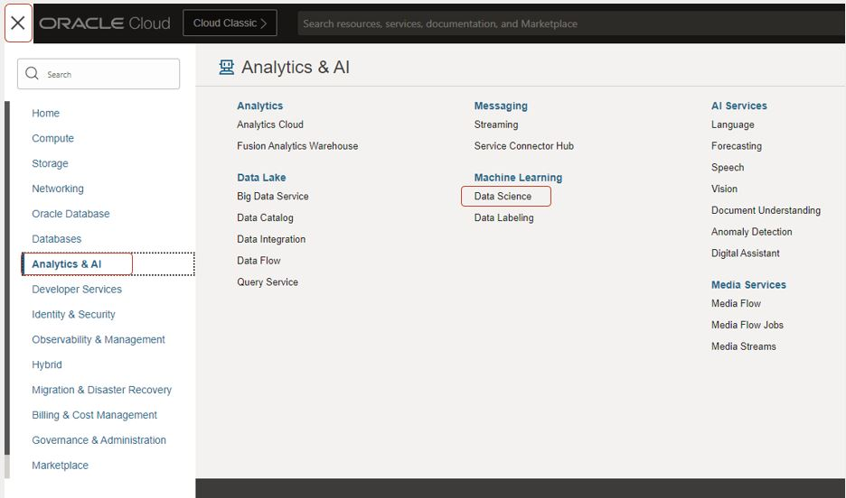
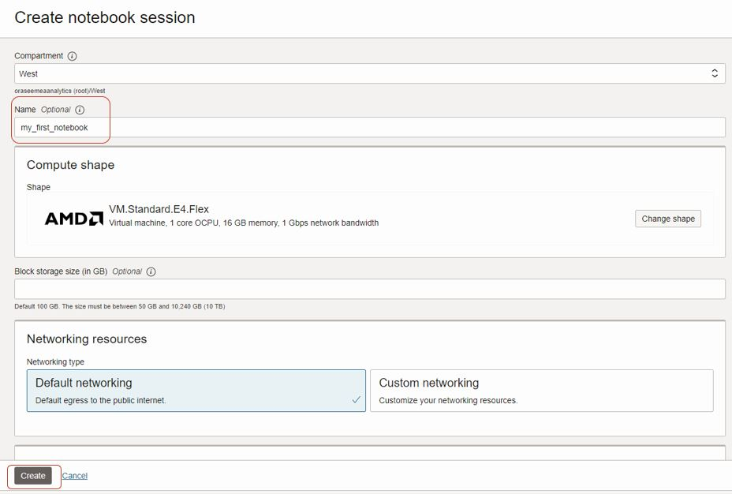
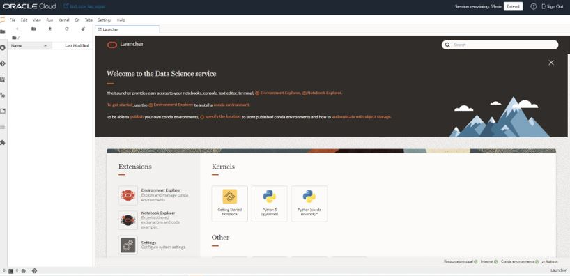
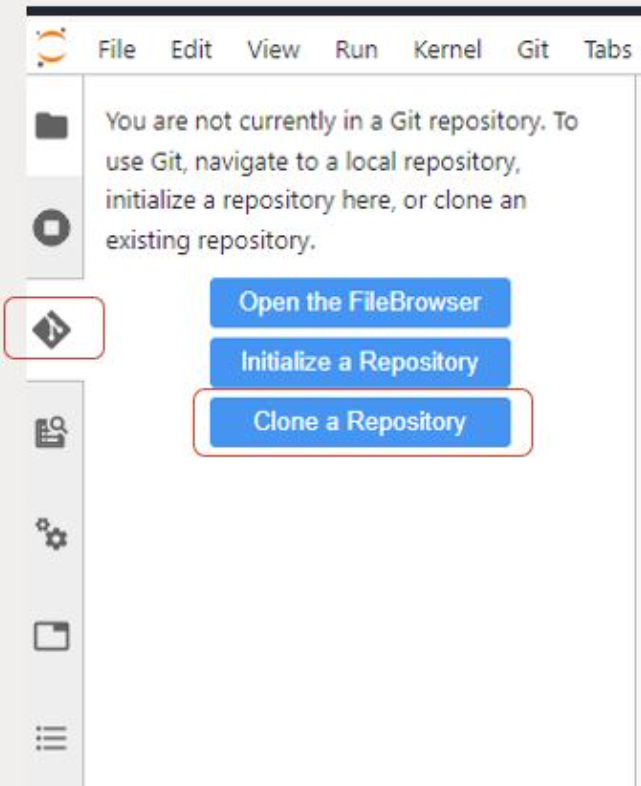

# Workshop material for University of Groningen - April 26

## **Steps to run the Workshop**

*Estimated Time:* 40 minutes

### Objectives

In this lab, you will:
* Log in Oracle Cloud
* Create a personal API Key
* Provision an OCI Data Science notebook
* Clone a respository from Github
* Run a Jupyter Notebook - Building a small Retrieval Augmented Generation application

### Prerequisites

* A tenancy that is configured to work with the Data Science service, including Jobs. Make sure to have all [policies and dynamic groups](https://docs.oracle.com/en-us/iaas/data-science/using/policies.htm) in place.
* An account that has permission to create a Data Science project.
* An account that has permission to create a Data Science notebook session.

## Task 1. Log in Oracle Cloud
1. To log in Oracle Cloud, go to [cloud.oracle.com](https://cloud.oracle.com/)
2. In the Cloud Account Name box, add **"oractdemeabdmanalytics""**. Click on Next
3. In the next screen, click on the "Sign in with an identity domain" list and select **"OracleIdentitycloudService""**
4. 

## Task 2: Create a Notebook session

1. In Oracle Cloud, click on the hamburger menu, and following on Analytics & AI
2. Click on **Data Science**
3. Select the correct compartment on the left
4. Select **Create Project**. You can name the Project to your own liking
5. Click on **Create**. This will create a project.
6. Step inside the project
  
  

7.	Click **Create Notebook**
8.	You can use all default settings, only change the name to **myfirstnotebook**
9.	Optional: change the shape of the notebook session by clicking on **Change Shape**
10.	Use **Default Networking**
11.	Leave Block storage size empty
12.	Click on **Create**
13.	This may take a few minutes, when the notebook is **Active**, click on the name of the notebook to access the main page
  

14.	Click on **Open** to open the notebook
15.	When you are prompted to log in, log in with your Oracle Cloud credentials
16.	The page as shown in the screenshot below should appear
  

## Task 3: Clone Repository and run notebook

1. Click on the **Git** tab on the left
2. Click on **Clone a Repository**
3. Add https://github.com/bobpeulen/rug_2024_workshop.git
4. Click **Clone**. A new, Offensive\_Behavior\_Lab repository should appear in the directory on the left
5. Step inside the **rug\_2024\_workshop** folder
6. Open the first notebook: **gen\_ai\_langchain\_faiss.ipynb**
7. When prompted for **Select Kernel**, just click on **Select**
8. Follow the steps in the notebook closely.
   
  
  

## Acknowledgements
* [Bob Peulen](https://www.linkedin.com/in/bobpeulen/)
* **Last Updated By/Date** - Bob Peulen, April 2024
