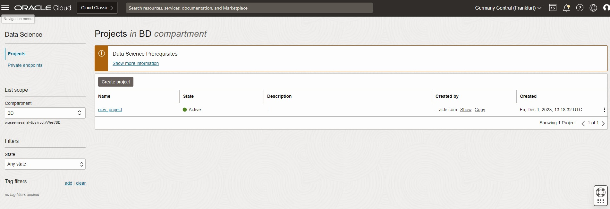

# Workshop material for University of Groningen - April 26

## **Steps to run the Workshop**

*Estimated Time:* 40 minutes

### Objectives

In this lab, you will:
* Log in Oracle Cloud
* Create a personal API Key
* Provision an OCI Data Science notebook
* Clone a respository from Github
* Run a Jupyter Notebook - Building a small Retrieval Augmented Generation application

### Prerequisites

* A tenancy that is configured to work with the Data Science service, including Jobs. Make sure to have all [policies and dynamic groups](https://docs.oracle.com/en-us/iaas/data-science/using/policies.htm) in place.
* An account that has permission to create a Data Science project.
* An account that has permission to create a Data Science notebook session.

## Task 1. Log in Oracle Cloud
1. xxxxxxxxxxxx
2. xxxx

## Task 2: Generate an API Key

Second, you will create an API Key. This API Key is needed to authenticate yourselves to invoke or use other services. Both APEX and OCI Data Science will need your API Key.

1. In the top-right corner, click the person Icon.
2. Click on **User Settings**
3. In the left, click on **API Keys** and following on **Add API Key**
4. First, click on **Download Private Key**. This will download the private key
5. Click on **Add**
6. Copy the **Configuration File Preview** starting with [DEFAULT] into a empty .txt file. Save the file as [**config**](https://docs.oracle.com/en-us/iaas/Content/API/Concepts/sdkconfig.htm) , without .txt as extension.
7. Important. Change the last line to key _ file = ./private _ key.pem. See an example config file with the made changes below
8. Important. In OCI Data Science, you have to rename the private key file to **private_key.pem**
9. Click on **Close** to close the window. You can review the API Key by click on the three dots on the right of it and select **View Configuration File**
    
    

## Task 3: Create a Notebook session

1. In Oracle Cloud, click on the hamburger menu, and following on Analytics & AI
2. Click on **Data Science**
3. Select the correct compartment on the left
4. Select **Create Project**. You can name the Project to your own liking
5. Click on **Create**. This will create a project.
6. Step inside the project
  
  

7.	Click **Create Notebook**
8.	You can use all default settings, only change the name to **myfirstnotebook**
9.	Optional: change the shape of the notebook session by clicking on **Change Shape**
10.	Use **Default Networking**
11.	Leave Block storage size empty
12.	Click on **Create**
13.	This may take a few minutes, when the notebook is **Active**, click on the name of the notebook to access the main page
  

14.	Click on **Open** to open the notebook
15.	When you are prompted to log in, log in with your Oracle Cloud credentials
16.	The page as shown in the screenshot below should appear
  

## Task 4: Clone Repository and run notebook

1. Click on the **Git** tab on the left
2. Click on **Clone a Repository**
3. Add https://github.com/bobpeulen/rug_2024_workshop.git
4. Click **Clone**. A new, Offensive\_Behavior\_Lab repository should appear in the directory on the left
5. Step inside the **rug\_2024\_workshop** folder
6. Open the first notebook: **gen\_ai\_langchain\_faiss.ipynb**
7. When prompted for **Select Kernel**, just click on **Select**
8. Follow the steps in the notebook closely.
   
  
  

## Acknowledgements
* [Bob Peulen](https://www.linkedin.com/in/bobpeulen/)
* **Last Updated By/Date** - Bob Peulen, April 2024
